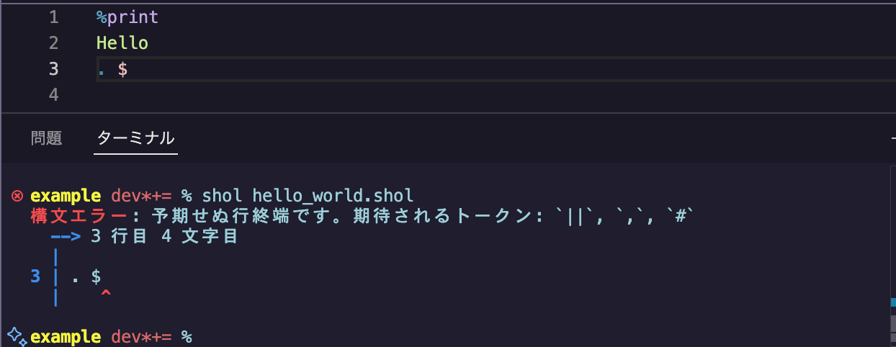

# 概要

やあやあ、霽月ですよ。

春休みの 5〜6 週間を費やして、オリジナルのプログラミング言語 **Shol** を開発してみました。

[コンパイラ演習の授業](https://kyomu.adm.okayama-u.ac.jp/Portal/Public/Syllabus/DetailMain.aspx?lct_year=2024&lct_cd=2024098423&je_cd=1)で yacc/lex を使って簡単な手続き型言語を作成するというのがあったのですが、手続き型以外の言語も作ってみたいなーと思って作ってみたのです。

言語の構想自体は以前からあって、初めの 4〜5 週間で[コンパイラ](https://github.com/Se1getsu/shol)、6 日で[ドキュメントサイト](https://se1getsu.github.io/shol/)、1 日で [VSCode のシンタックスハイライト拡張機能](https://github.com/Se1getsu/shol-syntax-highlight)を制作しました。

# Shol について

Shol は手続き型でも関数型でも論理型でもない、**独自のパラダイムを採用した宣言型のルールベース言語**です。

多くの言語で皆さんが慣れ親しんでいるような、変数、関数、制御構文(if, for, while)、エントリーポイント(main) などの概念が存在しない、異世界のような言語です。

[FizzBuzz](https://ja.wikipedia.org/wiki/Fizz_Buzz) はこんな感じで書けます。(1 から標準入力された数まで)

```
%cin
. $ #nGen 1, $.int

*nGen
. $n, $max # $n+1, $max, $n<$max
| $n, $max #fizzBuzz $n
. false #exit 0
| true #

*fizzBuzz
. $ % 3 = 0 # Fizz
| $ % 5 = 0 # Buzz
. Fizz, Buzz # FizzBuzz
. $ #print $

%print
%exit
```

もし興味があれば [チュートリアル](https://se1getsu.github.io/shol/docs/tutorial/intro) を読んでみてください。ショル助とショル子の会話形式で Shol についてざっくり学べます。

# コンパイラの作成

## コンパイラの概要

コンパイラの処理の流れはこんな感じです。

1. Shol のソースファイルからソースコードを読み取る。
2. **プリプロセス**：ソースコードに前処理を施す。
3. **字句・構文解析**：ソースコードを AST(抽象構文木) に変換する。
4. **意味解析**：AST を解析して型推論などを行い、その結果を AST に付与する。
5. **中間コード生成**：AST を解析して、Rust のコードに変換する。
6. **実行ファイル生成**：Rust のコンパイラを呼び出して実行ファイルを出力する。

中間コード生成は、元の言語と機械語との間を取り持つ**中間言語**を生成する工程です。一般的なコンパイラでは、アセンブリ(機械語と一対一に対応するような低水準言語)や LLVM-IR (コンパイラバックエンドの LLVM に渡す用の言語)のような言語のコードを生成することが多いです。しかし、Shol は非手続き型であり、そういった言語に変換するのはコストが高いことから、他の高級言語のコードを生成する(いわゆるトランスパイル)という方式を採ることにしました。

初めは C++ への変換を考えたのですが、C++ よりも楽にメモリ管理や文字列操作が行えて、かつ C++ と同等のパフォーマンスが発揮できる **Rust** を中間言語に採用することにしました。

コンパイラを実装するためには、Shol のコードがどのような Rust コードに変換されるのか、明確なイメージが必要です。すごく当たり前のことですが、手作業で C 言語をアセンブリや LLVM-IR に変換できない人は、 C 言語をアセンブリや LLVM-IR に変換するコンパイラを作ることはできません。僕は **Rust を触るのは初めて**だったので、慣れる必要がありました。そういうことなら、**コンパイラ自体も Rust で開発すれば効率がいいのでは**ということになり、Rust で作ったコンパイラで Rust を生成するということになったわけです。

## 字句・構文解析

字句解析はソースコードをトークン(字句)に分割、構文解析はそのトークン列から AST を生成する工程です。擬似言語で例を示すと大体こんなイメージです。

元のソースコード(文字列)：
```
int num; num = 1 + 2 * 3;
```

トークン列：
```
型(int), 変数名("num"), セミコロン, 変数名("num"), イコール,
  整数(1), 足す, 整数(2), 掛ける, 整数(3), セミコロン
```

AST(抽象構文木)：
```
    　プログラム
      ／    ＼
変数宣言文    代入文
  /  \      /   \
int  num  num    +
                / \
               1   *
                  / \
                 2   3
```

字句解析や構文解析のプログラムは、手書きすることも可能ですが、**パーサジェネレータ**(構文解析のプログラムを生成するツール)や**レキサージェネレータ**(字句解析のプログラムを生成するツール)を使用するのが一般的です。手書きよりも楽に作れて高速な解析が行えます。

[概要](#概要)でも触れた yacc/lex は、C や C++ でコンパイラを制作する時に使える、古典的なパーサ/レキサージェネレータです。他には Java の ANTLR も有名です。今回は Rust で開発するということで、選択肢はたくさんあるなか、**Lalrpop/Logos** という組み合わせで開発することにしました。

Lalrpop は、nom や Pest などの他のツールよりも[ドキュメント](https://lalrpop.github.io/lalrpop/index.html)が親切で分かりやすかったので採用しました(あと名前が可愛い)。`.lalrpop` という拡張子の文法ファイルを用意して、ビルド時にパーサ生成処理が自動で走るという感じになっています。

Logos は、Rust のツールの中では珍しい字句解析特化型です。Lalrpop だけでもレキサーまでカバー可能なのですが、Logos の方が複雑な字句解析処理を行えるので、カスタムレキサーとして Logos を連携させました。

パーサジェネレータはサポートする文法によって LL, LR, PEG などの分類がありますが、Lalrpop はその名の通り、LR 文法の一種の **LALR(1) 文法**をサポートします。yacc と同じ文法です。ただし yacc と違うところは、**シフト/還元競合 (shift/reduce conflict)** が警告ではなくビルドエラーになってしまうので、**曖昧な文法を完全に許容しない**という点です。これが相当大変でした。

「曖昧な文法」と聞くと、[dangling else](https://en.wikipedia.org/wiki/Dangling_else) のようなあからさまな曖昧な文法をイメージするかも知れませんが、LALR(1) 文法では 1 つ先のトークンまでしか先読みできないという条件の下で各生成規則の還元のタイミングを明確化するように文法をリファクタする必要があるのです。シフト/還元競合は概念自体もエラーメッセージも難解ですし、これに関しては ChatGPT は数塵たりとも役に立たないので、コツを掴みきるまでは茨の道を歩むことになりました。

初心者には、無限に先読みをしてくれる LL(*) 文法の **ANTLR** というパーサ/レキサージェネレータをお勧めしたいです。シフトとか還元とか難しいこと考えなくても書けますし、既存のあらゆる言語の文法を ANTLR の文法ファイルで再現した [grammars-v4](https://github.com/antlr/grammars-v4) というリポジトリもあるのでお手本見放題です。今回は Rust なので ANTLR は使えませんでしたが、grammars-v4 の Python と C の文法は参考にしています。

## 意味解析

意味解析では、[キャプチャ](https://se1getsu.github.io/shol/docs/tutorial/intro#:~:text=%E3%81%AF-,%E3%82%AD%E3%83%A3%E3%83%97%E3%83%81%E3%83%A3(capture),-%E3%81%A8%E5%91%BC%E3%81%B0)の型推論や、[条件式種別](https://se1getsu.github.io/shol/docs/reference/condition_kind)の決定などを行なっています。

キャプチャの型推論は、一般的な言語の型推論とは異なるため、Hindley-Milner のような既存の型推論アルゴリズムは使用できませんでした。Shol の独自概念であるキャプチャは、型を持つという点では他の言語の「変数」に近いとも言えますが、「変数」のように 1 つの型に定まるのではなく、キャプチャは「文字列または整数」のように複数の型を持つことができるのです。また、Shol には[キャプチャ間の型制約関係](https://se1getsu.github.io/shol/docs/reference/type_inference#%E3%82%AD%E3%83%A3%E3%83%97%E3%83%81%E3%83%A3%E9%96%93%E3%81%AE%E5%9E%8B%E5%88%B6%E7%B4%84%E9%96%A2%E4%BF%82)という独自の型エラーも存在します。

Shol では、型推論を制約充足問題として扱い、バックトラッキングや制約伝播アルゴリズムを使用しています。詳しくは Shol のドキュメント「[型推論](https://se1getsu.github.io/shol/docs/reference/type_inference)」を読んでみてください。

## コンパイルエラー

コンパイルエラーは字句解析で 10 種類、構文解析で 2 種類、意味解析で 15 種類ほど実装しています。エラーメッセージは Rust のコンパイルエラーを参考にしながら作ったので、なかなかのクォリティに仕上がりました。

これは字句解析のエラーメッセージの例です。


これは構文解析のエラーメッセージの例です。



これは意味解析のエラーメッセージの例です。


エラーメッセージは英語の方がいいかと思いましたが、海外進出するような実用的な言語ではないので日本語にしました。

# ドキュメントの作成

コンパイラができたら、次はドキュメントです。

今回は **Docusaurus** という React ベースの静的サイトジェネレータを使用して **GitHub Pages** を使ってデプロイを行いました。  
[Shol プログラミング言語 | Shol](https://se1getsu.github.io/shol/)

Docusaurus は Meta 社(旧 Facebook)が開発したドキュメント・ブログサイト用のフレームワークで、ドキュメントの内容を **Markdown** で書くことができるので執筆に集中できます。Markdown 以外にも js/ts ファイルや css ファイルをいじればレイアウトやデザインも自由にできますし、何より**コマンドひとつでビルドから GitHub Pages へのデプロイまで簡単にできる**のが便利ですね。仕組みとしては、ビルド成果物の HTML ファイルがそのリポジトリの `gh-pages` ブランチに自動でコミット＆プッシュされて、そのブランチが GitHub Pages のブランチとして設定されていればデプロイが動き出すという流れになっています。

Jest や React Native など、有名な企業や OSS も使っていたりするのでおすすめです。  
[Docusaurus Site Showcase | Docusaurus](https://docusaurus.io/showcase)

# VSCode 拡張機能の作成

- VSCode の拡張機能作った

# 実際に使ってみた

- 競プロで AC してる
